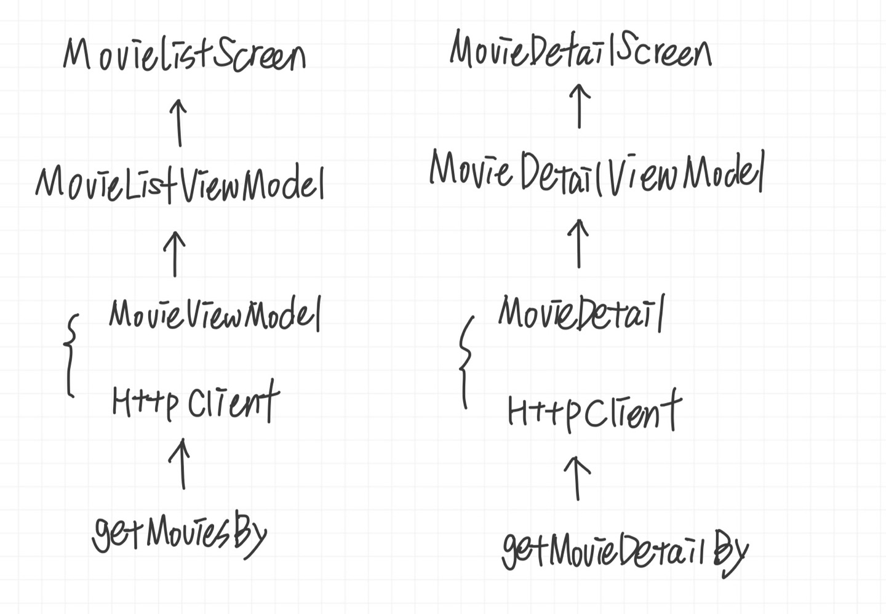
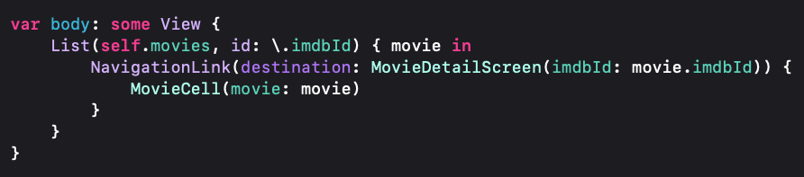
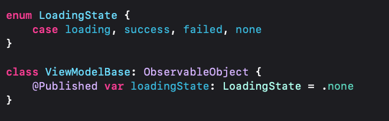
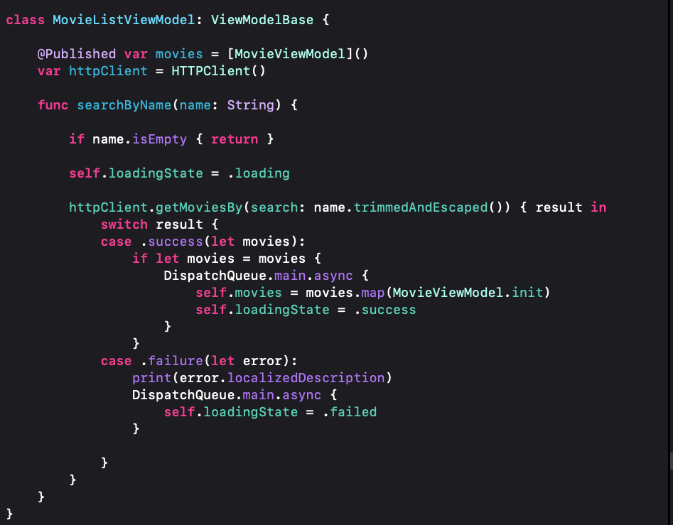
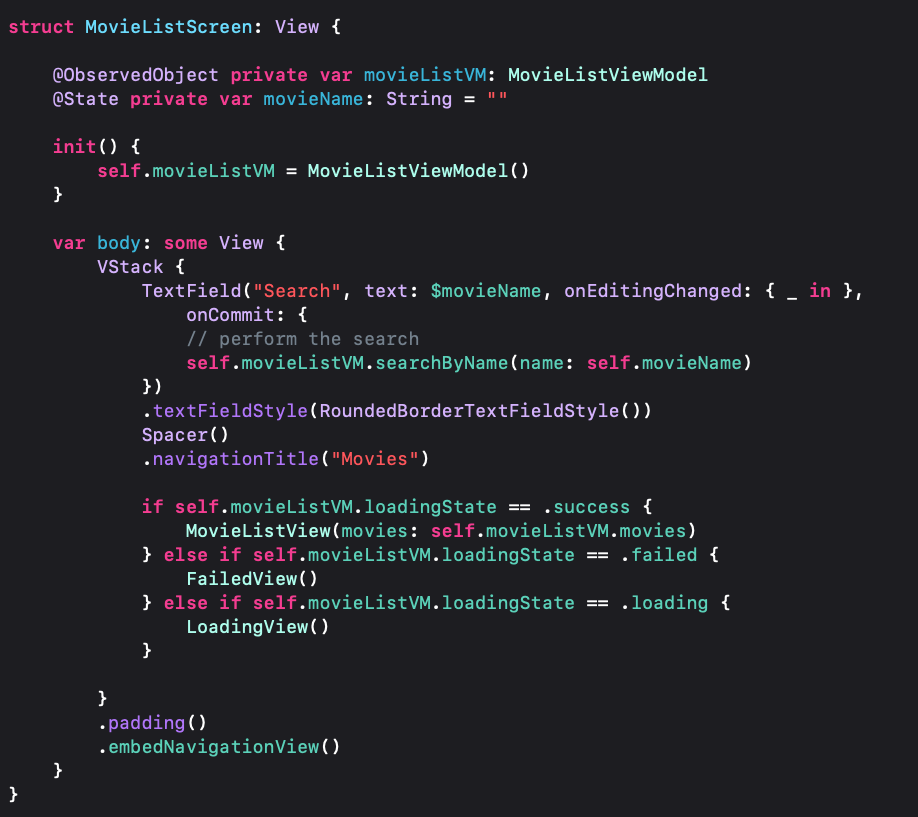

# MVVM Design Pattern in iOS Using SwiftUI  

## 1. Movies App  
1. Flow  
      

2. 새롭게 알게 된 것  
   2-1.   
   NavigationLink 를 사용하면 목적지에 필요한 UI도 구성할 수 있다는 점을 새롭게 알게 됨.  

   2-2.
     
     
     
   위와같이 앱 상태를 @Published 로 설정해주고 클래스 상속을 통해 접근해주고 @ObservedObject 를 사용해서 상태에 접근할 수 있는게 편리했던 것 같다. 앞에 붙은 키워드에 대한 공부는 좀 더 필요할듯